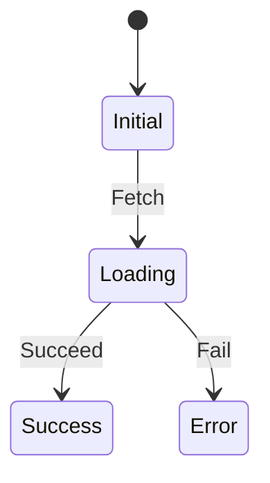
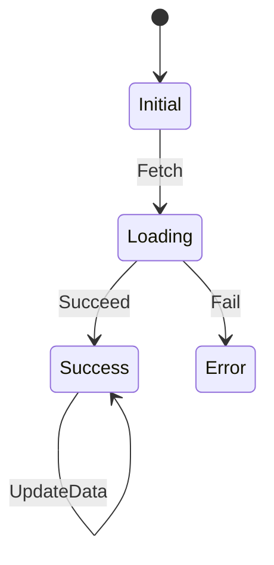

<!-- 
This README describes the package. If you publish this package to pub.dev,
this README's contents appear on the landing page for your package.

For information about how to write a good package README, see the guide for
[writing package pages](https://dart.dev/guides/libraries/writing-package-pages). 

For general information about developing packages, see the Dart guide for
[creating packages](https://dart.dev/guides/libraries/create-library-packages)
and the Flutter guide for
[developing packages and plugins](https://flutter.dev/developing-packages). 
-->

# dart_fsm
Dartで有限オートマトンを実現するためのパッケージ。

## 有限オートマトンについて
有限オートマトンとは、有限個の状態と遷移と動作の組み合わせからなる数学的に抽象化された「ふるまいのモデル」です。
アプリケーションの取りうる状態を有限オートマトンとしてモデル化することで以下のような恩恵が得られます。
* アプリケーションの設計段階での考慮漏れが少なくなる
* 設計段階で有限オートマトンを設計することで、設計と実装の間のギャップを埋めることができる
* 状態を有限オートマトンに則って定義することで不要なnullチェックを排除することができる
* 状態を有限オートマトンに則って定義することで、考慮していない存在しない状態の発生を防ぐことができる
* アプリケーションの状態が意図せず変更されることを防ぐことができる
* テストが容易になる

有限オートマトンを用いたアプリケーションの設計は、アプリケーションの複雑さが増すにつれて有効性が高まります。

## モチベーション
有限オートマトンを用いた状態管理が有用であることは説明した通りですが、switch文やif文を用いた有限オートマトンの実装は状態の遷移が複雑になるにつれて可読性が低下し、バグの発生源となりやすくなります。
また、開発者により状態の遷移が異なる実装になることがあり、コードの保守性が低下します。
そのため、有限オートマトンを用いた状態管理を行う際には、状態の遷移を明確に定義し、自動的に行う仕組みが必要です。
また、アプリケーションでの状態管理に使用する場合、状態の遷移にともなう副作用としてAPIの呼び出しなどを発生させたい場合があります。
そのような副作用の実装もパッケージを利用しない場合、開発者により異なる実装になり、コードの保守性が低下することがあります。

そのため、本パッケージでは有限オートマトンを用いた状態管理を行う際に状態の遷移を明確に定義し、状態の遷移を自動的に行う仕組みを提供します。
また、状態の遷移にともなう副作用の実装もパッケージ内で定義することで、開発者による実装の違いを排除し、コードの保守性を向上させます。
## 機能
1. 副作用の入らない状態遷移図の記述DSL
2. 状態遷移に伴う副作用の実装方法の提供
3. Streamなどの断続的に値が流れてくる状況における有限オートマトンの実装方法の提供
4. 有限オートマトンを用いたテストの実装方法の提供
5. 有限オートマトン自体のテストの実装方法の提供

## 使用方法
### 状態遷移図の記述
有限オートマトンは通常状態遷移図を用いて表現されます。
本パッケージでは状態遷移図を記述するためのDSLを提供します。
例えば以下のような有限オートマトンの遷移図を考えてみましょう。

この遷移図をdart_fsmで記述します。まずは状態とアクションの定義を行います。
状態の定義はsealed classを用いて以下のように行います。
```dart
sealed class SampleState {
  const SampleState();
}

final class SampleStateInitial extends SampleState {
  const SampleStateInitial();
}

  
final class SampleStateLoading extends SampleState {
  const SampleStateLoading();
}

final class SampleStateSuccess extends SampleState {
  const SampleStateSuccess(this.data);
  
  final Data data;
}

final class SampleStateError extends SampleState {
  const SampleStateError(this.exception);
  
  final Exception exception;
}
```
アクションについても同様にsealed classを用いて以下のように行います。
```dart
sealed class SampleAction {
  const SampleAction();
}

final class SampleActionFetch extends SampleAction {
  const SampleActionFetch();
}

final class SampleActionSucceed extends SampleAction {
  const SampleActionSucceed(this.data);
  
  final Data data;
}

final class SampleActionFail extends SampleAction {
  const SampleActionFail(this.exception);
  
  final Exception exception;
}
```
次に状態遷移図を記述します。本パッケージにはGraphBuilderというクラスが用意されており、これを用いて状態遷移図を記述します。
まずGraphBuilderをインスタンス化し、stateとonメソッドを用いて状態遷移図を記述します。
onメソッドは遷移前の状態とアクションを受け取り、遷移後の状態を返す関数を引数に取ります。
```dart
final stateGraph = GraphBuilder<SampleState, SampleAction>()
  ..state<SampleStateInitial>(
    (b) => b
      ..on<SampleActionFetch>(
        (state, action) => b.transitionTo(const SampleStateLoading()),
      ),
  )
  ..state<SampleStateLoading>(
    (b) => b
      ..on<SampleActionSucceed>(
        (state, action) => b.transitionTo(SampleStateSuccess(action.data)),
      )
      ..on<SampleActionFail>(
        (state, action) => b.transitionTo(SampleStateError(action.exception)),
      ),
  );
```
状態遷移図の記述が完了したら、状態遷移図を用いて有限オートマトンを生成します。
```dart
final stateMachine = createStateMachine(
  initialState: const SampleStateInitial(),
  graphBuilder: stateGraph,
);
```
これで有限オートマトンが生成されました。状態遷移はdispatchメソッドを用いて有限オートマトンにアクションを発行することで行います。
```dart
stateMachine.dispatch(const SampleActionFetch());
```
有限オートマトンの状態はstateプロパティ、またはstateStreamプロパティを用いてStreamで取得することができます。
```dart
print(stateMachine.state); 
stateMachine.stateStream.listen((state) {
  print(state);
});
```

### 副作用の実装
先ほどの状態遷移図をもう一度見てみましょう。

この状態遷移図において、Loading状態に遷移した際にはApiを呼び出す副作用を発生させたいとします。
このような副作用を発生させるためにはSideEffectCreatorおよびSideEffectを用いて副作用を定義します。
SideEffectCreatorは副作用を生成するためのクラスであり、SideEffectは副作用を表すクラスです。
Before、After、Finallyの3種類が存在し以下のタイミングで呼び出されます。
* AfterSideEffectCreator: アクションが発行された直後、状態遷移前に実行される
* BeforeSideEffectCreator: アクションが発行され、状態の遷移が行われた後に実行される
* FinallySideEffectCreator: アクションが発行された後、状態の遷移が行われたか否かにかかわらず実行される

最も使用頻度が高いのは多くの場合でAfterSideEffectCreatorであり、
遷移にともなうApiの呼び出しやデータの保存などの副作用を発生させるための使用に適しています。
では、Loading状態に遷移した際にApiを呼び出す副作用を発生させるための実装を行います。
```dart
final class SampleSideEffectCreator
    implements AfterSideEffectCreator<SampleState, SampleAction, SampleSideEffect> {
  const SampleSideEffectCreator(this.apiClient);

  final ApiClient apiClient;

  @override
  SampleSideEffect? create(SampleState state, SampleAction action) {
    return switch (action) {
      SampleActionFetch() => SampleSideEffect(apiClient),
      _ => null,
    };
  }
}

final class SampleSideEffect
    implements AfterSideEffect<SampleState, SampleAction> {
  const SampleSideEffect(this.apiClient);

  final ApiClient apiClient;

  @override
  Future<void> execute(
      StateMachine<SampleState, SampleAction> stateMachine) async {
    try {
      final data = await apiClient.fetchData();
      stateMachine.dispatch(SampleActionSucceed(data));
    } on Exception catch (e) {
      stateMachine.dispatch(SampleActionFail(e));
    }
  }
}
```
> [!NOTE]
> ApiClientはApiを呼び出すためのクラスであり、コンストラクタで受け取るようにしていますが、これは疎結合性を高めるためです。

これでApiを呼び出すSampleSideEffectと、遷移時の条件によってSampleSideEffectを生成するSampleSideEffectCreatorが定義されました。
次にこれらを有限オートマトンに登録します。
```dart
final stateMachine = createStateMachine(
  initialState: const SampleStateInitial(),
  graphBuilder: stateGraph,
  sideEffectCreator: SampleSideEffectCreator(apiClient),
);
```
これでApiを呼び出す副作用が有限オートマトンに登録されました。
状態遷移が行われるたびにSampleSideEffectCreatorが呼び出され、その状態遷移を発生させたアクションがFetchであればSampleSideEffectが生成され、Apiが呼び出されます。

### Streamなどの断続的に値が流れてくる状況における有限オートマトンの実装
Streamなどの断続的に値が流れてくる状況において有限オートマトンを実装する場合、Subscriptionというクラスを用いて実装します。
SubscriptionはStateMachineのインスタンが生成される時に1回のみ呼び出され、その後はStateMachineのインスタンスが破棄されるまで有効です。
以下のような状態遷移図を考えてみましょう。

Success状態に遷移した後もUpdateDataアクションが発行されるたびにデータを更新するとします。
StreamをもとにUpdateDataアクションを発行するSubscriptionを実装します。
```dart
final class SampleSubscription
    implements Subscription<SampleState, SampleAction> {
  SampleSubscription(this.webSocketClient);

  final WebSocketClient webSocketClient;

  StreamSubscription<Data>? _subscription;

  @override
  void subscribe(StateMachine<SampleState, SampleAction> stateMachine) {
    _subscription = webSocketClient.subscribeData().listen((data) {
      stateMachine.dispatch(SampleActionUpdate(data));
    });
  }

  @override
  void dispose() {
    _subscription?.cancel();
  }
}
```
これでWebSocketClientからデータを受け取り、データをもとにSampleActionUpdateを発行するSubscriptionが定義されました。
これをSideEffectCreator同様にStateMachineに登録します。
```dart
final stateMachine = createStateMachine(
  initialState: const SampleStateInitial(),
  graphBuilder: stateGraph,
  sideEffectCreator: SampleSideEffectCreator(apiClient),
  subscription: SampleSubscription(webSocketClient),
);
```
これでWebSocketClientからデータを受け取り、データをもとにSampleActionUpdateを発行するSubscriptionが有限オートマトンに登録されました。

### 有限オートマトンを用いたテストの実装
TODO


## 使用例
```dart
import 'package:dart_fsm/dart_fsm.dart';

// State
sealed class SampleState {
  const SampleState();
}

final class SampleStateA extends SampleState {
  const SampleStateA();
}

final class SampleStateB extends SampleState {
  const SampleStateB();
}

// Action
sealed class SampleAction {
  const SampleAction();
}

final class SampleActionA extends SampleAction {
  const SampleActionA();
}

void main() {
  final stateMachineGraph = GraphBuilder<SampleState, SampleAction>()
    ..state<SampleStateA>(
      (b) => b
        ..on<SampleActionA>(
          (state, action) => b.transitionTo(const SampleStateB()),
        ),
    );

  final stateMachine = createStateMachine(
    initialState: const SampleStateA(),
    graphBuilder: stateMachineGraph,
  );

  print(stateMachine.state); // SampleStateA

  stateMachine.dispatch(const SampleActionA());

  print(stateMachine.state); // SampleStateB
}
```