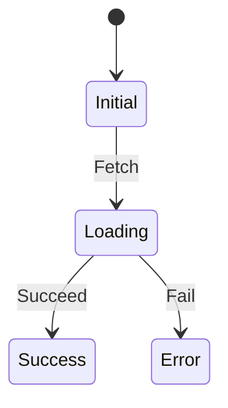
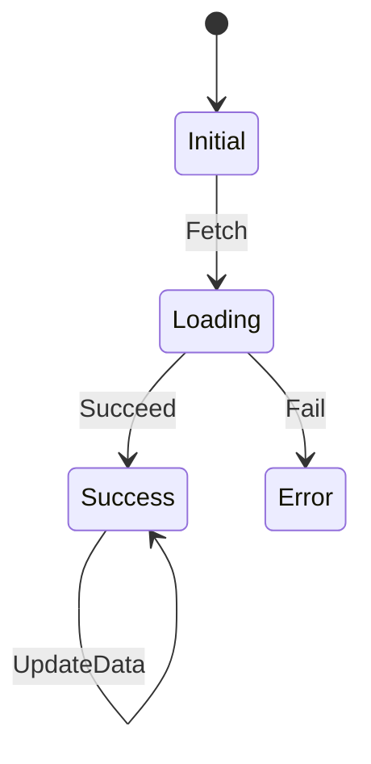

<!-- 
This README describes the package. If you publish this package to pub.dev,
this README's contents appear on the landing page for your package.

For information about how to write a good package README, see the guide for
[writing package pages](https://dart.dev/guides/libraries/writing-package-pages). 

For general information about developing packages, see the Dart guide for
[creating packages](https://dart.dev/guides/libraries/create-library-packages)
and the Flutter guide for
[developing packages and plugins](https://flutter.dev/developing-packages). 
-->

# dart_fsm
A package for implementing finite state machines in Dart.

## About Finite State Machines
A finite state machine is a mathematically abstracted "behavior model" composed of a finite number of states, transitions, and actions. Modeling the possible states of an application as a finite state machine provides several benefits:
* Reduces the likelihood of missed considerations during the application design phase
* Bridges the gap between design and implementation by designing the finite state machine at the design stage
* Eliminates unnecessary null checks by defining states in line with the finite state machine
* Prevents the occurrence of unforeseen non-existent states by defining states in accordance with the finite state machine
* Prevents unintentional changes to the application state
* Makes testing easier

The effectiveness of designing applications using finite state machines increases as the complexity of the application grows.

## Motivation
While state management using finite state machines is useful, implementing finite state machines using switch statements or if statements can become unreadable and prone to bugs as state transitions become complex. Additionally, different developers may implement state transitions differently, reducing code maintainability. Therefore, when managing state with finite state machines, it is necessary to clearly define state transitions and automate them. Furthermore, when using state management in applications, there may be cases where you want to trigger side effects, such as API calls, during state transitions. Without a package, varying implementations by developers can reduce code maintainability.

This package provides a mechanism to clearly define state transitions when managing state with finite state machines and automates state transitions. It also defines the implementation of side effects within the package to eliminate implementation differences between developers and improves code maintainability.

## Features
1. DSL (Domain Specific Language) for describing state transition diagrams without side effects
2. Providing implementation methods for side effects accompanying state transitions
3. Providing implementation methods for finite state machines in scenarios where values flow intermittently, such as Streams
4. Providing implementation methods for tests using finite state machines
5. Providing implementation methods for testing finite state machines themselves

## Usage
### Describing State Transition Diagrams
Finite state machines are typically represented using state transition diagrams. This package provides a DSL for describing state transition diagrams. Consider the following state transition diagram:

We will describe this transition diagram using dart_fsm. First, define the states and actions. States are defined using sealed classes as shown below.
```dart
sealed class SampleState {
  const SampleState();
}

final class SampleStateInitial extends SampleState {
  const SampleStateInitial();
}

  
final class SampleStateLoading extends SampleState {
  const SampleStateLoading();
}

final class SampleStateSuccess extends SampleState {
  const SampleStateSuccess(this.data);
  
  final Data data;
}

final class SampleStateError extends SampleState {
  const SampleStateError(this.exception);
  
  final Exception exception;
}
```
Similarly, actions are defined using sealed classes as shown below.
```dart
sealed class SampleAction {
  const SampleAction();
}

final class SampleActionFetch extends SampleAction {
  const SampleActionFetch();
}

final class SampleActionSucceed extends SampleAction {
  const SampleActionSucceed(this.data);
  
  final Data data;
}

final class SampleActionFail extends SampleAction {
  const SampleActionFail(this.exception);
  
  final Exception exception;
}
```
Next, describe the state transition diagram. This package provides a class called `GraphBuilder`, which can be used to describe state transition diagrams. Instantiate the `GraphBuilder` and use the `state` and `on` methods to describe the state transition diagram.
The `on` method takes a function that accepts the previous state and action and returns the next state as arguments.
```dart
final stateGraph = GraphBuilder<SampleState, SampleAction>()
  ..state<SampleStateInitial>(
    (b) => b
      ..on<SampleActionFetch>(
        (state, action) => b.transitionTo(const SampleStateLoading()),
      ),
  )
  ..state<SampleStateLoading>(
    (b) => b
      ..on<SampleActionSucceed>(
        (state, action) => b.transitionTo(SampleStateSuccess(action.data)),
      )
      ..on<SampleActionFail>(
        (state, action) => b.transitionTo(SampleStateError(action.exception)),
      ),
  );
```
After describing the state transition diagram, generate the finite state machine using the state transition diagram.
```dart
final stateMachine = createStateMachine(
  initialState: const SampleStateInitial(),
  graphBuilder: stateGraph,
);
```
This generates the finite state machine. State transitions are performed by issuing actions to the finite state machine using the `dispatch` method.
```dart
stateMachine.dispatch(const SampleActionFetch());
```
The state of the finite state machine can be obtained using the `state` property or the `stateStream` property to acquire a Stream.
```dart
print(stateMachine.state); 
stateMachine.stateStream.listen((state) {
  print(state);
});
```

### Implementing Side Effects
Let's take another look at the state transition diagram:

Suppose you want to trigger a side effect of making an API call when transitioning to the `Loading` state. To implement such side effects, define the side effects using `SideEffectCreator` and `SideEffect`. `SideEffectCreator` is a class for generating side effects, and `SideEffect` represents the side effects.
There are three types: `After`, `Before`, and `Finally`, which are called at the following times:

•   `AfterSideEffectCreator`: Executed immediately after an action is issued, before the state transitions.
•   `BeforeSideEffectCreator`: Executed after an action is issued and the state transition has occurred.
•   `FinallySideEffectCreator`: Executed after an action is issued, regardless of whether the state transition has occurred.

In many cases, `AfterSideEffectCreator` is the most frequently used and is suitable for generating side effects such as API calls or saving data that occur as a result of state transitions.

Let's implement the side effect to make an API call when transitioning to the `Loading` state.
```dart
final class SampleSideEffectCreator
    implements AfterSideEffectCreator<SampleState, SampleAction, SampleSideEffect> {
  const SampleSideEffectCreator(this.apiClient);

  final ApiClient apiClient;

  @override
  SampleSideEffect? create(SampleState state, SampleAction action) {
    return switch (action) {
      SampleActionFetch() => SampleSideEffect(apiClient),
      _ => null,
    };
  }
}

final class SampleSideEffect
    implements AfterSideEffect<SampleState, SampleAction> {
  const SampleSideEffect(this.apiClient);

  final ApiClient apiClient;

  @override
  Future<void> execute(
      StateMachine<SampleState, SampleAction> stateMachine) async {
    try {
      final data = await apiClient.fetchData();
      stateMachine.dispatch(SampleActionSucceed(data));
    } on Exception catch (e) {
      stateMachine.dispatch(SampleActionFail(e));
    }
  }
}
```
> [!NOTE]
> The `ApiClient` is a class for making API calls, and it is received in the constructor to enhance loose coupling.

Now that the `SampleSideEffect` to make API calls and the `SampleSideEffectCreator` to generate the `SampleSideEffect` based on transition conditions have been defined, register them with the finite state machine.
```dart
final stateMachine = createStateMachine(
  initialState: const SampleStateInitial(),
  graphBuilder: stateGraph,
  sideEffectCreator: SampleSideEffectCreator(apiClient),
);
```
This registers the side effect to make API calls with the finite state machine. Each time a state transition occurs, the `SampleSideEffectCreator` is called, and if the action that caused the transition is `Fetch`, a `SampleSideEffect` is generated, and the API is called.

### Implementing Finite State Machines in Intermittent Value Scenarios such as Streams

When implementing finite state machines in scenarios where values flow intermittently, such as Streams, the `Subscription` class is used. `Subscription` is called only once when the `StateMachine` instance is generated and remains valid until the `StateMachine` instance is disposed of. Consider the following state transition diagram:

Suppose you want to update the data each time the `UpdateData` action is issued after transitioning to the `Success` state. Implement a `Subscription` that issues the `SampleActionUpdate` action based on a Stream.
```dart
final class SampleSubscription
    implements Subscription<SampleState, SampleAction> {
  SampleSubscription(this.webSocketClient);

  final WebSocketClient webSocketClient;

  StreamSubscription<Data>? _subscription;

  @override
  void subscribe(StateMachine<SampleState, SampleAction> stateMachine) {
    _subscription = webSocketClient.subscribeData().listen((data) {
      stateMachine.dispatch(SampleActionUpdate(data));
    });
  }

  @override
  void dispose() {
    _subscription?.cancel();
  }
}
```
This defines a `Subscription` to receive data from the `WebSocketClient` and issue `SampleActionUpdate` based on the data. Register this `Subscription` with the `StateMachine` similarly to the `SideEffectCreator`.
```dart
final stateMachine = createStateMachine(
  initialState: const SampleStateInitial(),
  graphBuilder: stateGraph,
  sideEffectCreator: SampleSideEffectCreator(apiClient),
  subscription: SampleSubscription(webSocketClient),
);
```
This registers the `Subscription` with the finite state machine to receive data from the `WebSocketClient` and issue `SampleActionUpdate` based on the data.

### Implementing Tests Using Finite State Machines
TODO


## Example Usage
```dart
import 'package:dart_fsm/dart_fsm.dart';

// State
sealed class SampleState {
  const SampleState();
}

final class SampleStateA extends SampleState {
  const SampleStateA();
}

final class SampleStateB extends SampleState {
  const SampleStateB();
}

// Action
sealed class SampleAction {
  const SampleAction();
}

final class SampleActionA extends SampleAction {
  const SampleActionA();
}

void main() {
  final stateMachineGraph = GraphBuilder<SampleState, SampleAction>()
    ..state<SampleStateA>(
      (b) => b
        ..on<SampleActionA>(
          (state, action) => b.transitionTo(const SampleStateB()),
        ),
    );

  final stateMachine = createStateMachine(
    initialState: const SampleStateA(),
    graphBuilder: stateMachineGraph,
  );

  print(stateMachine.state); // SampleStateA

  stateMachine.dispatch(const SampleActionA());

  print(stateMachine.state); // SampleStateB
}
```